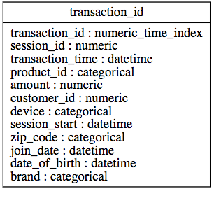
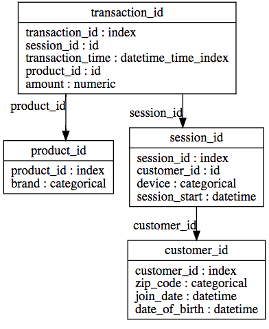

# AutoNormalize

[](https://circleci.com/gh/FeatureLabs/autonormalize)

AutoNormalize is a Python library for automated datatable normalization, intended for use with [Feature Tools](https://github.com/Featuretools/featuretools). AutoNormalize allows you to build an `EntitySet` from a single denormalized table and generate features for machine learning.

Before AutoNormalize:

   

After AutoNormalize:


<br />
### Install
```shell
pip install autonormalize
```
### Uninstall
```shell
pip uninstall autonormalize
```
<br />

### API Reference
```shell
auto_entityset(df, accuracy=0.98, index=None, name=None, time_index=None)
```
Creates a normalized entityset from a dataframe.

Arguments:

`df` (pd.Dataframe) : the dataframe containing data

`accuracy` (0 < float <= 1.00; default = 0.98) : the accuracy threshold required in order to conclude a dependency (i.e. with accuracy = 0.98, 0.98 of the rows must hold true the dependency LHS --> RHS)

`index` (str, optional) : name of column that is intended index of df

`name` (str, optional) : the name of created EntitySet

`time_index` (str, optional) : name of time column in the dataframe.

Returns:

`entityset` (ft.EntitySet) : created entity set

<br />

```shell
find_dependencies(df, accuracy=0.98, index=None)
```
Finds dependencies within dataframe with the DFD search algorithm.

Returns:

`dependencies` (Dependencies) : the dependencies found in the data within the contraints provided

<br />

```shell
normalize_dataframe(df, dependencies)
```
Normalizes dataframe based on the dependencies given.

Returns:

`new_dfs` (list[pd.DataFrame]) : list of new dataframes

<br />

```shell
make_entityset(df, dependencies, name=None, time_index=None):
```
Creates a normalized EntitySet from dataframe based on the dependencies given.

Returns:

`entityset` (ft.EntitySet) : created EntitySet

<br />

## Feature Labs
<a href="https://www.featurelabs.com/">
    
</a>

AutoNormalize is an open source project created by [Feature Labs](https://www.featurelabs.com/). To see the other open source projects we're working on visit Feature Labs [Open Source](https://www.featurelabs.com/open). If building impactful data science pipelines is important to you or your business, please [get in touch](https://www.featurelabs.com/contact/).
